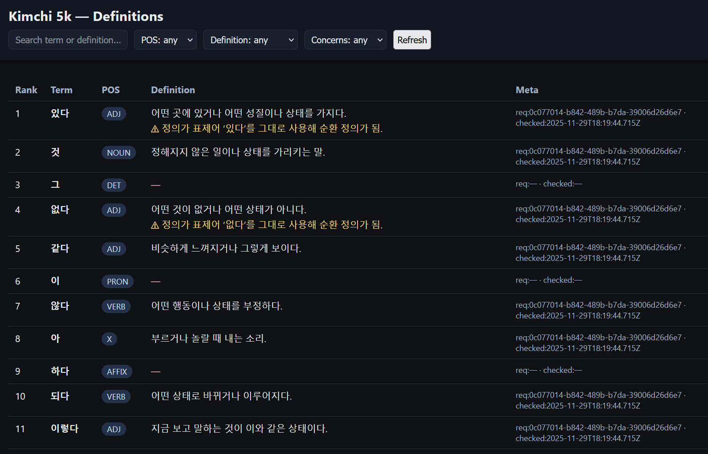

# Kimchi 5000

Toolkit and browser UI for experimenting with the [Kimchi Reader](https://kimchi-reader.app/) word frequency list using OpenAI and Google Cloud Natural Language (lemmatization).

## Why?

Read my rationale [here](https://rickcarlino.com/notes/korean-language/monolingual-vocab-card-experiment.html).

## Notes

Each item has a "Part of Speech" (POS) attribute. Not all parts of speech are useful when memorizing vocabulary lists.

Generally, I care more about these:
 - "ADJ"
 - "ADV"
 - "CONJ"
 - "NOUN"
 - "VERB"

and often ignore these:
 - "AFFIX"
 - "DET"
- "NUM"
- "PRON"
- "PRT"
- "PUNCT"
- "X"

## Utilities

- `bun run utils/to-json.ts` — Parse `raw/*.txt` frequency files into `data/terms.json`.
- `bun run utils/lema.ts` — Lemmatize terms with Google Cloud NLP into `data/1-lemmas.json`.
- `bun run utils/add-definitions.ts` — Generate learner-friendly Korean one-sentence definitions with GPT-5 in batches of 50, writing/merging into `data/2-definitions.json`. Idempotent: skips ranks that already have `def` and writes progress after each batch. Stores `defRequestId` per batch for traceability. Non-target POS (e.g., `X`) are kept in the file with `def: null` but never sent to the LLM.
- `bun run utils/spot-check.ts` — Quick sampling or batch clearing by `defRequestId`.  
  - Sample: `bun run utils/spot-check.ts [--id UUID[,UUID2]]` prints up to 3 `term: def` lines per request.  
  - Delete: `bun run utils/spot-check.ts --delete UUID[,UUID2]` sets `def` to `null` and clears `defRequestId` for those batches (so they can be regenerated).
- `bun run utils/patrol.ts` — LLM quality patrol over definitions that lack `llmCheckOn`. Batches of 50 audit entries, stamp `llmCheckOn`, store serious `concerns` (definition only), and auto-fix incorrect POS to one of: `ADJ, ADV, CONJ, NOUN, VERB, AFFIX, DET, NUM, PRON, PRT, PUNCT, X`. Progress logs show batch counts. Edit the `USER_PROMPT` at the top of `utils/patrol.ts` to tune the checker.
- `bun run utils/server.ts` — Tiny Bun webserver to browse `data/2-definitions.json` locally (in-memory). Filters by search, POS, has/missing definition, and concerns; shows metadata (`defRequestId`, `llmCheckOn`). Default port 3000; override with `PORT=4000 bun run utils/server.ts`.

## TODO

 - Batch proof-editor (POS, def) -> tag problematic attirbutes.
 - Images
 - Hanja
 - Definition translation
 - Term translation
 - alternative forms: noun modifying, past tense, etc.
 - Browser UI
    - Approval UI.

## Setup

- Copy `.env.example` to `.env` and fill in your keys (OpenAI + Google Cloud service account with the Natural Language API enabled).
- Install dependencies (already in `package.json`): `bun install`

## Running

- Summaries via OpenAI: `bun run index.ts summary "Kimchi Reader contains high-frequency Korean vocabulary..."`
- Lemmatization via Google NLP: `bun run index.ts lemmas "Kimchi Reader contains high-frequency Korean vocabulary..."`
- Build combined JSON from `raw/*.txt`: `bun run utils/to-json.ts` (writes `data/terms.json`)

The CLI prints a usage hint when run without arguments.
